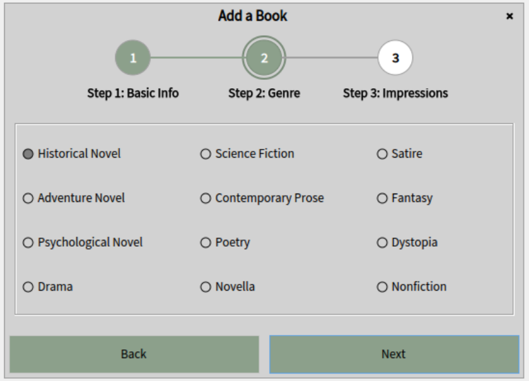

📘 SpecComponentsLibrary Documentation

## Table of contents

- [Introduction](#1-introduction)
  - [Motivation](#motivation)
  - [Architecture](#architecture)

- [Styling and Configuration](#2-styling-and-configuration)
  - [Styling API](#styling-api)
  - [Using PresenterDecorator](#using-presenterdecorator)
  - [Ready-to-Use Stylable Components](#ready-to-use-stylable-components)

- [Input Components](#3-input-components)
  - [TextInputPresenter](#textinputpresenter)
  - [ValidationRules](#validationrules)
  - [ComboBoxPresenter](#comboboxpresenter)
  - [MultiSelectComboBoxPresenter](#multiselectcomboboxpresenter)
  - [CheckboxGroupPresenter](#checkboxgrouppresenter)
  - [RadioGroupPresenter](#radiogrouppresenter)
  - [TimePickerPresenter](#timepickerpresenter)

- [Data Display](#4-data-display)
  - [SearchableTablePresenter](#searchabletablepresenter)
  - [PaginatedTablePresenter](#paginatedtablepresenter)

- [Form Construction](#5-form-construction)
  - [DynamicFormBuilder](#dynamicformbuilder)
  - [API](#api)
  - [Styling with FormStyle](#styling-with-formstyle)

- [Process Control](#6-process-control)
  - [WizardPresenter](#wizardpresenter)

- [Notifications](#7-notifications)
  - [NotificationPresenter](#notificationpresenter)

## 1. Introduction

### Motivation

While Spec 2 offers a powerful MVP-based framework for building Pharo UIs, it lacks several commonly used components (such as time pickers, filtered tables, multiselect dropdowns), and its style system, based on STON configuration, can be verbose and error-prone.

SpecComponentsLibrary was developed to address these limitations by:
- Introducing missing components ready for production use
- Enabling inline styling via code instead of STON blocks
- Providing high-level builders and reusable UI patterns

The components integrate seamlessly with existing Spec applications and remain fully compatible with `SpPresenter`, `SpApplication`, and Spec’s layout system.

### Architecture

The core architectural ideas include:

- `BasePresenter` — shared superclass for all stylable components, with built-in support for visual property setters (`color:`, `fontSize:`, `borderWidth:`, etc.)
- `StyleManager` — utility class that converts a dictionary of visual properties into a valid Spec 2 `SpStyle` and registers it in the application
- `PresenterDecorator` — lightweight wrapper that enables styling on existing Spec 2 presenters (such as `SpButtonPresenter`, `SpLabelPresenter`, etc.) by embedding them into a `BasePresenter`. It is useful when you want to style a core Spec component without subclassing it.
- Component groups organized by purpose: input, forms, collections, flow, and feedback
- Declarative construction: components like `DynamicFormBuilder` allow defining forms using a key-based DSL

All components are implemented as Spec presenters and can be used standalone or embedded in other presenters, windows, or Spec applications.

---
## 2. Styling and Configuration

`SpecComponentsLibrary` allows you to style UI components directly in code, without writing STON blocks or managing global stylesheets. This makes it easier to quickly build and customize interfaces, especially during prototyping or when working in the Playground.
All components that support styling inherit from `BasePresenter` and expose a consistent styling API.

---

### Styling API

You can use the following methods on any stylable component:

* `color:` — text color
* `backgroundColor:` — background color
* `fontSize:`, `fontFamily:`, `bold`, `italic` — font styling
* `width:`, `height:` — size
* `borderColor:`, `borderWidth:` — border styling
* `hResizing:`, `vResizing:` — layout behavior

These methods apply changes immediately and register the generated style in the current application context.

#### Example

```smalltalk
label := LabelPresenter new.
label
  text: 'Email';
  fontSize: 14;
  color: '#darkGray';
  bold;
  italic.
```

---

### Using `PresenterDecorator`

If you want to apply styles to a standard Spec 2 component (such as `SpButtonPresenter`), you can wrap it using `PresenterDecorator`. 

```smalltalk
styled := PresenterDecorator wrap: SpButtonPresenter.
styled
  backgroundColor: '#green';
  fontSize: 16.
styled mainPresenter label: 'Confirm'.
```

Alternatively, wrap an existing instance:

```smalltalk
raw := SpLabelPresenter new.
raw label: 'Status:'.

styled := PresenterDecorator wrap: raw.
styled
  color: '#gray';
  italic.
```

> ⚠️ Only use this for basic Spec 2 presenters. Do not wrap components that already inherit from `BasePresenter` or belong to this library.

#### `mainPresenter:` / `mainPresenter`

When using a `PresenterDecorator`, the actual Spec 2 component being styled is held in the `mainPresenter` variable.

* `mainPresenter:` — sets the core presenter to decorate (can be a class or instance)
* `mainPresenter` — returns the currently wrapped presenter

This allows full access to the underlying presenter's API while still applying styles through the decorator. Use this when you need to configure properties specific to the core component (e.g., labels, models, callbacks).

##### Example

```smalltalk
dropList := PresenterDecorator wrap: SpDropListPresenter .
dropList mainPresenter items: #( 'Low' 'Medium' 'High' ).
dropList backgroundColor: '#yellow'.
```

In this example, the dropdown is customized through both `mainPresenter` and styling methods, ensuring visual integration without modifying global stylesheets.

---

### Ready-to-Use Stylable Components

Instead of wrapping presenters manually, most common UI elements already have stylable wrappers included in the library. These classes inherit from `BasePresenter`, are ready to use, and support the full styling API.

| Component | Stylable Wrapper    |
| --------- | ------------------- |
| Label     | `LabelPresenter`    |
| Button    | `ButtonPresenter`   |
| Checkbox  | `CheckboxPresenter` |
| RadioButton  | `RadioButtonPresenter` |
| List      | `ListPresenter`     |

#### Example

```smalltalk
button := ButtonPresenter new.
button
  label: 'Save';
  backgroundColor: '#blue';
  fontSize: 13;
  onClick: [ self saveData ].
```

These components integrate smoothly into Spec layouts and can be used anywhere a `SpPresenter` is expected.

## 3. Input Components

This section covers the basic input controls included in the library, designed to simplify user input and enhance interaction.
All input components support styling via the same API shown earlier.

---

### TextInputPresenter

A stylable input field for entering single-line text, with optional validation logic.
The component supports placeholder text and dynamic styling through `BasePresenter`. Validation rules can be attached to check user input automatically after each keystroke.

#### API

* `text:` / `text` — set or get the current value entered in the text field
* `placeholder:` — set the placeholder (hint) text shown when the field is empty
* `isValidationField:` / `isValidationField` — enable or check whether the field performs input validation
* `isValid` — returns `true` if the current text satisfies all validation rules
* `addValidationRule: message:` — add a single validation rule as a block and an associated error message
* `addValidationRules:` — add multiple validation rules using a `ValidationRules` object
* `onValidationChangedDo:` — set a callback to be triggered when the validation status changes

>⚠️ The field will only perform validation if the isValidationEnabled property is set to true.

#### Example

```smalltalk
field := TextInputPresenter new.
field
  backgroundColor: '#F2F2F2';
  isValidationField: true;
  addValidationRule: [ :txt | txt includes: $@ ] message: 'Invalid email';
  onValidationChangedDo: [ :isValid |
    isValid ifTrue: [ Transcript show: 'Valid input' ]
  ].
```

<p align="center">
  
  <br/>
  <em>Email validation using <code>TextInputPresenter</code></em>
</p>

### ValidationRules

`ValidationRules` is a utility class for defining reusable validation logic for text input fields. It allows bundling multiple rule blocks with error messages and applying them to any `TextInputPresenter` instance.

Each rule is a pair:

* **block** — a predicate that takes the current text and returns a boolean
* **message** — a string to be shown if the rule fails

#### API

* `addRule: aBlock message: aString` — adds a rule with its error message
* `addRulePair: aBlock -> aString` — alternative form
* `all` — returns all added rules
* `applyTo: aPresenter` — applies all rules to a given input field using `addValidationRule:message:`

#### Built-in Rule Factories (Class Side)

```smalltalk
ValidationRules nonEmpty.
ValidationRules isEmail.
ValidationRules minLength: 5.
ValidationRules maxLength: 20.
```

These return rule pairs (`block -> message`) that you can add with `addRulePair:` or include in collections.

#### Example. Custom Rule Set

```smalltalk
rules := ValidationRules new.
rules
  addRule: [ :txt | txt notEmpty ] message: 'Field is required';
  addRule: [ :txt | txt includes: $@ ] message: 'Email must contain @'.

input addValidationRules: rules.
```

#### Example. Using Built-in Rules

```smalltalk
rules := ValidationRules new.
rules
  addRulePair: ValidationRules nonEmpty;
  addRulePair: ValidationRules isEmail;
  addRulePair: (ValidationRules minLength: 8).

input addValidationRules: rules.
```

These rules will be automatically triggered when the user types, if the field is marked as a validation field.

---

### ComboBoxPresenter

A dropdown list with built-in filtering and single selection.
The component combines a text input field for search and a dropdown list of options. Users can filter the list by typing, and select a single item by clicking.

#### API

* `items:` — sets the list of available options
* `allItems` — returns the full list of all items (before filtering)
* `filteredItems` — returns the list of items currently matching the search query
* `selectIndex:` — selects an item by its index (0-based)
* `selectedIndex` — returns the index of the currently selected item
* `selectedItem` — returns the currently selected item
* `whenSelectionChangedDo:` — sets a callback to be triggered when the selection changes
* `textInput` — returns the internal text input presenter used for filtering

#### Example

```smalltalk
combo := ComboBoxPresenter new.
combo
  items: #('Apple' 'Banana' 'Cherry');
  whenSelectionChangedDo: [ :selected |
    Transcript show: 'Selected: ', selected asString; cr ].
```

The selected value is displayed in the text input once chosen. Filtering is case-insensitive.

---

### MultiSelectComboBoxPresenter

A dropdown that allows multiple selections using checkboxes.
Instead of returning a single item, this component allows the user to select many values by checking boxes inside the dropdown list.

#### API

* `items:` — sets the list of available options
* `allItems` — returns the full list of all items (before filtering)
* `filteredItems` — returns the list of items currently matching the search query
* `selectedItems` — returns the set of currently selected items
* `selectedIndexes:` — sets the selected items by their indexes
* `whenSelectionChangedDo:` — sets a callback triggered when the selection of any checkbox changes
* `textInput` — returns the internal text input presenter used for filtering

#### Example

```smalltalk
multi := MultiSelectComboBoxPresenter new.
multi
  items: #('Linux' 'Windows' 'macOS');
  selectedIndexes: #(1 3);
  whenSelectionChangedDo: [ :selected |
    Transcript show: 'Selected OS: ', selected asString; cr ].
```
<p align="center">
  
  <br/>
  <em>Filterable multi-select combo box</em>
</p>

When the dropdown is closed, the text field shows a comma-separated list of selected items. When opened, it switches to filter mode.

> Internally, this component uses `SpComponentListPresenter` with `CheckboxPresenter` elements to render the list.

---

### CheckboxGroupPresenter

A component that displays a group of checkboxes, allowing users to select multiple values from a list.
You can control layout by specifying the number of columns, adding a frame, and enabling scroll support. The presenter provides methods to access selected values and track changes.

#### API

* `items:` — set the list of options  
* `addItem:` — add a new checkbox to the group  
* `removeItem:` — remove a checkbox from the group  
* `itemAtIndex:` — return the checkbox at the given index  
* `selectedItems` — return the values of all selected checkboxes  
* `selectedIndexes` — return the indexes of all selected checkboxes  
* `isCheckedAt:` — check whether the checkbox at the given index is selected  
* `toggleSelectionAt:` — toggle the selection state of the checkbox at the given index  
* `clearSelection` — deselect all checkboxes  
* `whenSelectionChangedDo:` — register a callback triggered when any checkbox changes state  
* `title` — return the current group title  
* `title:` — set the group title  
* `columnCount:` — set the number of columns to split items into (minimum 1)  
* `display:` — set a block that converts item values into label text  
* `enableButtonAt:` — enable the checkbox at the given index  
* `disableButtonAt:` — disable the checkbox at the given index  
* `enableScrolling:` — enable or disable scrollability for the group  
* `showTitle:` — show or hide the group title  
* `showFrame:` — show or hide the border around the group  

#### Example

```smalltalk
group := CheckboxGroupPresenter new.
group
  items: #('Email' 'SMS' 'Push Notification' 'Other');
  columnCount: 2;
  showFrame: true;
  showTitle: true;
  title: 'Preferred Contact Methods';
  whenSelectionChangedDo: [ :indexes |
    Transcript show: 'Selected indexes: ', indexes printString; cr ].
```
<p align="center">
  
  <br/>
  <em> Preferred contact methods using checkbox group</em>
</p>

---

### RadioGroupPresenter

A component that displays a group of radio buttons for selecting one item from a list.
Only one item may be selected at a time. Selecting a new item deselects the previous one. Useful for gender, payment type, etc.

#### API

* `items:` — set the list of options  
* `addItem:` — add a new radio button to the group  
* `removeItem:` — remove a radio button from the group  
* `itemAtIndex:` — return the radio button at the given index  
* `itemSelected` — return the value of the selected radio button  
* `indexSelected` — return the index of the selected radio button  
* `selectedIndex:` — programmatically select a button by index  
* `clearSelection` — deselect the currently selected radio button  
* `whenIndexChangedDo:` — register a callback triggered when the selected index changes  
* `title` — return the current group title  
* `title:` — set the group title  
* `columnCount:` — set the number of columns to display items (minimum 1)  
* `display:` — set a block for rendering item labels from values  
* `enableButtonAt:` — enable the radio button at the given index  
* `disableButtonAt:` — disable the radio button at the given index  
* `enableScrolling:` — enable or disable scrolling for the group  
* `showTitle:` — show or hide the title label  
* `showFrame:` — show or hide a border around the group  

#### Example

```smalltalk
group := RadioGroupPresenter new.
group
  items: #('Credit Card' 'PayPal' 'Bank Transfer');
  columnCount: 1;
  showTitle: true;
  title: 'Payment Method';
  whenIndexChangedDo: [ :choice |
    Transcript show: 'Payment option: ', choice asString; cr ].
```

> Use `clearSelection` if you want to reset the group manually.

---

### TimePickerPresenter

A UI component that allows users to select time using an interactive clock dialog.
It consists of a read-only text field and a button with a clock icon. When clicked, a modal dialog opens with a circular time selector powered by Roassal.

#### API

* `hour` / `hour:` — get or set the selected hour (0–23)  
* `minutes` / `minutes:` — get or set the selected minutes (0–59)  
* `whenTimeChangedDo:` — set a callback triggered when the time is changed (after OK is pressed in the dialog)  
* `color:` — set the primary accent color for the clock interface  
* `additionColor:` — set the secondary color used to highlight active elements or selection modes  
* `okButtonLabel:` — set the label text for the OK button in the dialog  
* `cancelButtonLabel:` — set the label text for the Cancel button in the dialog  

#### Dialog Behavior

When the dialog is opened via `openDialog`, the current time is passed to the internal `TimePickerDialogPresenter`. The user can:

- Switch between hour and minute selection
- Choose AM/PM mode
- Confirm or cancel the selection

After confirmation, the selected time is shown in the main field in `HH:MM` format, and the `whenTimeChangedDo:` callback is triggered.

> Note: The dialog uses Roassal shapes and event handlers for full interaction.

#### Example

```smalltalk
time := TimePickerPresenter new.
time
  hour: 14;
  minutes: 30;
  whenTimeChangedDo: [
    Transcript show: 'Time changed to: ', time hour printString, ':', time minutes printString; cr
  ].
```

## 4. Data Display

This section covers components used to display collections of items, with built-in support for filtering, pagination, and selection.

---

### SearchableTablePresenter

A data table with live filtering support.
This component extends a standard `SpTablePresenter` by adding a search field and a column selector. Users can filter visible rows based on search input and select which columns to include in the filter.
It consists of:
- a `SpTablePresenter` for rendering data
- a `TextInputPresenter` for search queries
- a `MultiSelectComboBoxPresenter` for selecting searchable columns

#### API

* `items:` — set the full dataset (each row should be a dictionary)  
* `columns:` — define table columns as key → label pairs  
* `displayUsing:` — set a custom formatting block for how cell values are rendered  
* `selectedItem` — get the currently selected row from the table  
* `filteredItems` — return the list of rows that match the current filter criteria  
* `whenSelectedItemChangedDo:` — register a callback triggered when the selected item changes  
* `showSearchContainer` / `hideSearchContainer` — show or hide the filtering UI (search field and column selector)  
* `filterField` — access the text input presenter used for search  
* `table` — access the internal `SpTablePresenter` for advanced configuration  
  
> Column configuration is done by passing a dictionary of column name → accessor key.

#### Example

```smalltalk
table := SearchableTablePresenter new.
table
  columns: {
    'Name' -> #name.
    'Email' -> #email.
    'Role' -> #role.
  };
  items: {
    (Dictionary new
        at: #name put: 'Alice';
        at: #email put: 'alice@example.com';
        at: #role put: 'Admin';
        yourself).
        
    (Dictionary new
        at: #name put: 'Bob';
        at: #email put: 'bob@example.com';
        at: #role put: 'User';
        yourself).
        
    (Dictionary new
        at: #name put: 'Charlie';
        at: #email put: 'charlie@example.com';
        at: #role put: 'Moderator';
        yourself)
}
```

As the user types into the search field, the table dynamically updates to show matching rows.

---

### PaginatedTablePresenter

A searchable table with pagination support.
Inherits all features from `SearchableTablePresenter` and adds UI for navigating between pages, jumping to a specific page, and customizing the number of rows per page.
Includes:
- page buttons (next, previous, numbered)
- input field for direct page access
- current/total page counter

#### Additional API

- `itemsPerPage:` — set number of rows per page  
- `currentPage` — get current page number  
- `goToPage:` — jump to a specific page   
- `previousPage`, `nextPage` — navigate pages  
- `gotoPageInput`, `gotoPageButton` — access navigation input and button  
- `displayedItems` — get items for current page  

#### Example

```smalltalk
table := PaginatedTablePresenter new.
table
  columns: {
    'Name' -> #name.
    'Email' -> #email.
    'Role' -> #role.
  };
  items: {
    (Dictionary new
        at: #name put: 'Alice';
        at: #email put: 'alice@example.com';
        at: #role put: 'Admin';
        yourself).
        
    (Dictionary new
        at: #name put: 'Bob';
        at: #email put: 'bob@example.com';
        at: #role put: 'User';
        yourself).
        
    (Dictionary new
        at: #name put: 'Charlie';
        at: #email put: 'charlie@example.com';
        at: #role put: 'Moderator';
        yourself)
}
  itemsPerPage: 2.
```
<p align="center">
  
  <br/>
  <em>Reading Journal with tabbed pages and pagination</em>
</p>

The table shows pagination controls below the grid: current page, total pages, navigation arrows, and a text box for jumping directly to a page.

## 5. Form Construction

`DynamicFormBuilder` is a high-level component that allows you to build data entry forms declaratively.  
Instead of manually creating and laying out each field, you define fields using DSL-style methods such as `textField:label:placeholder:rules:`.
The form automatically generates layout, validation hooks, submit/back buttons, and styling support.

---

### DynamicFormBuilder

A grid-based dynamic form that supports:

- declarative field creation via methods
- validation rules per text field
- custom headers and buttons
- styling via `FormStyle`
- data collection and submission

#### Supported Field Types

| Field Method                   | Description                             |
|-------------------------------|-----------------------------------------|
| `textField:label:placeholder:rules:` | Single-line text input (with validation) |
| `comboBox:label:items:`       | Filterable single-select dropdown       |
| `multiComboBox:label:items:`  | Dropdown with checkbox multiselect      |
| `checkbox:label:`             | Single checkbox                         |
| `checkboxGroup:label:items:columns:frame:` | Multi-option checkbox group       |
| `radioGroup:label:items:columns:frame:`    | Radio group for single selection |
| `dropList:label:items:`       | Standard Spec drop-down list            |
| `datePicker:label:`           | Date selector                           |
| `timePicker:label:`           | Time selector                           |

#### Basic Usage

```smalltalk
form := DynamicFormBuilder new.
form
  header: 'User Registration';
  textField: #name label: 'Name' placeholder: 'Enter full name' rules: nil;
  comboBox: #role label: 'Role' items: #('Admin' 'User' 'Guest');
  onSubmit: [ :values | Transcript show: values; cr ].
form open.
```

Each field is associated with a key (e.g., `#name`), which is used to retrieve values on submission.

> Call `collectValues` or use the `onSubmit:` block to access entered data.

#### API

The following methods are available to configure the form and extract values:

- `header:` — set the title text above the form  
- `onSubmit:` — provide a block to call when the user clicks the submit button  
- `onBack:` — (optional) callback for the back/cancel button  
- `style:` — apply a `FormStyle` to control fonts, spacing, colors  
- `values` — return current form values as a dictionary  
- `collectValues` — same as `values`, but always recalculates  
- `validateFields` — return `true` if all validation fields pass

You can also control layout visibility:

- `hideHeader`, `showHeader` — toggle header visibility  
- `hideButtons`, `showButtons` — toggle submit/back buttons  
- `topPresenter:` — insert a custom presenter above the form

#### Styling with `FormStyle`

You can apply visual styling to the form using a `FormStyle` object. It supports customizing:

- font size and color for labels and headers
- field sizes, background colors, borders
- button dimensions

```smalltalk
style := FormStyle new.
style
  headerFontSize: 14;
  labelFontSize: 12;
  inputBackground: '#veryLightGray';
  inputBorderColor: '#gray';
  buttonWidth: 100.

form := DynamicFormBuilder new.
form
  style: style;
  header: 'Contact';
  height: 50;
  textField: #email label: 'Email' placeholder: '' rules: nil.
```
<p align="center">
  
  <br/>
  <em>Registration form with multiple input types</em>
</p>


## 6. Process Control

This section introduces the `WizardPresenter`, a component for building multi-step interfaces — useful for guided input, registration wizards, or complex workflows.

---

### WizardPresenter

`WizardPresenter` manages a linear sequence of steps. Each step is a regular Spec presenter, and the wizard provides built-in navigation (Next, Back) and a header that shows current progress.

Features
- Step-by-step navigation
- Visual step tracker (with optional labels)
- Support for cancel/back actions
- Styled layout and buttons
- Integration with `DynamicFormBuilder` or any custom presenter

#### API

* `steps:` — set an ordered collection of steps (each step must be a dictionary with keys `#title` and `#content`)
* `goToNextStep` / `goToPreviousStep` / `goToStep:` — navigate to the next, previous, or specific step by index
* `stepPresenterAt:` — access the content presenter of a specific step
* `whenStepChangedDo:` — register a callback triggered when the active step changes
* `onFinishDo:` — register a callback triggered when the wizard is completed
* `visibleStepCount:` — set the maximum number of steps visible in the header at once
* `stepCircleRadius:` — set the radius (in pixels) of the step indicator circles
* `stepCircleTitleColor:` — set the color of the text labels inside step indicators
* `activeColor:` — set the highlight color for the currently active step
* `nextButtonLabel:` — set the label text for the Next button
* `finishButtonLabel:` — set the label text for the Finish button
* `nextButton` / `backButton` — access navigation buttons for custom configuration or styling

#### Example

```smalltalk
wizard := WizardPresenter new
nextButtonLabel: 'Next';
finishButtonLabel: 'Finish';
activeColor: '#8ca08b'.
wizard backButton label: 'Back'.

form1 := DynamicFormBuilder new.
form1
  hideButtons;
  textField: #name label: 'Name' placeholder: 'e.g. Alice' rules: nil.

form2 := DynamicFormBuilder new.
form2
  hideButtons;
  textField: #email label: 'Email' placeholder: 'example@mail.com' rules: nil.

form3 := DynamicFormBuilder new.
form3
  hideButtons;
  checkbox: #subscribe label: 'Subscribe to newsletter' text: ''.

step1 := Dictionary new.
step1 at: #title put: 'User'.
step1 at: #content put: form1 layout.

step2 := Dictionary new.
step2 at: #title put: 'Email'.
step2 at: #content put: form2 layout.

step3 := Dictionary new.
step3 at: #title put: 'Options'.
step3 at: #content put: form3 layout.

wizard
  steps: { step1. step2. step3 };
  onFinishDo: [
    Transcript
      show: 'Finish'; cr].
```
<p align="center">
  
  <br/>
  <em>Multi-step wizard with genre selection</em>
</p>


## 7. Notifications

`NotificationPresenter` is a utility class for showing transient in-window messages (toasts).  
It's useful for confirming user actions (e.g. save success, errors, or alerts) without opening modal dialogs.
The notification appears as an overlay in a corner or center of the given window, styled with custom text, colors, and display duration.

---

### NotificationPresenter

You create and configure the presenter via setters, then call `showOn:` to display it over a specific `SpWindowPresenter`.

#### API

- `title:` — header text  
- `message:` — main message body  
- `type:` — predefined type (`#info`, `#success`, `#warning`, `#error`)  
- `duration:` — seconds before the message disappears (default: 3)  
- `position:` — `#topLeft`, `#topRight`, `#bottomLeft`, `#bottomRight`, `#center`  
- `font:` — font used for both title and message  
- `textColor:` — color of text  
- `backgroundColor:` — background fill (overrides type if set)  
- `width:`, `height:` — fixed size of the message box  
- `window:` — the `SpWindowPresenter` to anchor to (required)  
- `show` — render the message

#### Example

```smalltalk
notification := NotificationPresenter new.
notification
  title: 'Saved';
  message: 'Changes have been successfully saved.';
  type: #success;
  position: #topRight;
  window: activeWindow;
  duration: 3;
  show.
```
<p align="center">
  
  <br/>
  <em>Notification with submitted data</em>
</p>

> The notification disappears automatically after the given duration. No user action is required.
